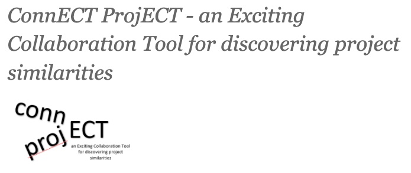

### CW21 - 2021-03-30

Leo - CI12-CW21

### **Participants**

_Please list the participants here_

_Emma Rand emma.rand@york.ac.uk_

_Aida Mehonic_

_Hannah Williams Hannah.Williams@phe.gov.uk_

_Carlos Martinez-Ortiz_

_Flic Anderson  [contact@felicityanderson.co.uk](mailto:contact@felicityanderson.co.uk) _

---

_This document should be used to capture the information for a Collaborative Session / Hack Day Idea. (The total amount of text should ideally be between 100-300 words and you can include a diagram or two). The document should be no larger than two pages of A4. Don’t delete the details at the top of the document but you should delete all of this hint text (Arial, italic, grey, size 11) once you no longer need it._

### ConnECT ProjECT - an Exciting Collaboration Tool for discovering project similarities

### **Context / Research Domain**

_Collaboration - not research domain specific_

### **Problem**

_Lots of individuals/groups working on projects (for example a large funded project), but it can be difficult to identify commonalities, opportunities for collaboration and start useful discussions. _

*   _Share knowledge across domains_
*   _Avoid duplications_
*   _Encourage collaboration _
*   _Would be good to link between organisations too _
*   _Bumping into the right person at the coffee machine has become impossible for teams over 70 people - to share knowledge _

### **Solution**

_Either a form (useful for non-repository projects) or some sort of automated tagging for remotely hosted repositories (e.g. GitHub repos) which feeds into a dashboard, to visualise commonalities:_

*   _Topics / domain fields, but not only this (to avoid “it’s not my domain” turn-off)._
*   _Methods that repositories have in common (e.g. unit testing, particular statistical tests, project management methods)_
*   _Language/tools similarities (might be able to tie into existing analysis by GitHub of repos for example, but collect this information for projects at other stages or in other formats too)_
*   _Visual prompt to start conversations / know which discussions to have._
*   _Prompt when another member of the group/team adds a project that is similar, to maintain collaborations throughout the life-cycle of x (e.g. invitation to code review ‘most similar’ projects, or a “other projects like yours have used x technology/method” suggestion prompt)_
*   _Prompt when starting from scratch - have you seen x?_

_Elements of the solution: (how to break it down for implementation)_

*   Form to gather data from non-version-controlled projects & save data
    *   web-form?
*   API tool to scrape/gather same information for GitHub repositories & save data
    *   Scan READMEs (if exist)
    *   Scrape code (look for keywords, check for words/functions matching ontologies)
    *   Project staff can add extras tags (somehow link ‘scraped’ results to webform)
*   Tidy gathered data into one structure (& clean)
*   Dashboard UI to display project ‘tags’ (ie similarities) & highlight similarities (ideally .pdf or .html version which can be shared by link to start conversations between project staff/managers)
    *   Show ‘most similar’ projects & key contacts
    *   Tickmarks for shared ‘tags’

Possible Gotchas: 

*   Data security / GDP - contact detail sharing for example
*   Levels of access & authorisation between projects and institutions
*   Inter-organisation barriers
*   Secrecy or lack of confidence in sharing?
*   Requires all to be on board with using readmes, documentation, mentioning keywords etc.

### **Diagrams / Illustrations**

_You can include one or two diagrams in this section. Please ensure you have the right to use the image(s), and include an attribution if applicable._

### Licence

These materials (unless otherwise specified) are available under the Creative Commons Attribution 4.0 Licence. Please see the [human-readable summary](https://creativecommons.org/licenses/by/4.0/) of the CC BY 4.0 and the full [legal text](https://creativecommons.org/licenses/by/4.0/legalcode) for further information. 

