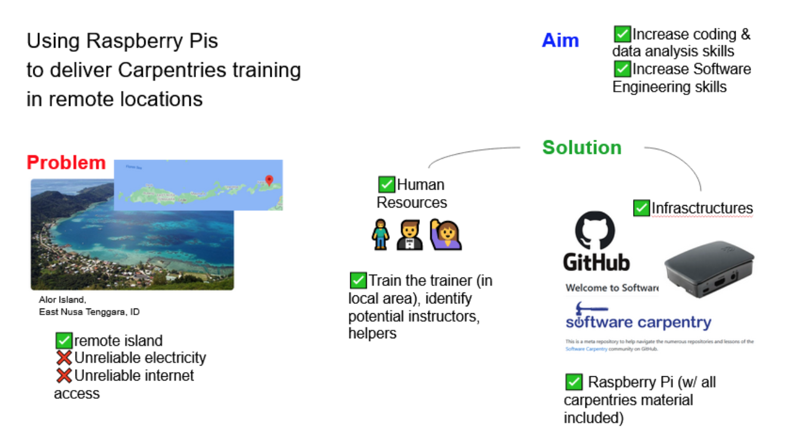

### CW21 Hack Day - 2021-03-31 to 2021-04-01

Lovelace-1842 - HP16-CW21

### **Hack Day idea proposer**

Becca Wilson
Irma Hafidz
Alison Clarke
Talia Caplan
Jannetta Steyn

---

_This document should be used to capture the information for a Hack Day Idea._

### **Idea name (provisional)**

_This is the provisional name of the Idea, solution or just a title; this can be changed later if a team is formed and you decide on a new team/product name._

_Using Raspberry Pis to deliver Carpentries training in remote locations_

### **Context and/or research domain**

_Please describe the context and/or research domain to which the problem applies_

Low-to-Middle-Income Countries (LMICs) experience several challenges in building capacity of data analysis or software engineering skills that are necessary for contemporary data science. Several training programmes exist online, however these may not be easily accessible or in formats that can be utilised.

### **Problem**

_Description of the problem you are trying to solve_

Software and data carpentries courses provide training in fundamental data skills essential to conducting research. Training researchers in these data skills is an essential part of empowering researchers in LMICs. However, delivering these courses depends on reliable internet access. That means that individuals who are living in areas with unreliable internet access, quite literally cannot access this valuable training.

### **Solution**

_Explanation of the solution to the problem you have identified_

Create an infrastructure using raspberry pis to deliver software and data carpentries offline and in remote areas. The idea is that a trainer could carry the devices to the training location, use keyboards/mice/displays that are already there, and easily set up a network that contains all the training materials, with no need for external internet access.

The materials would all be available on GitHub and licensed so that anyone could take the materials, set up their own network of Raspberry Pis, and deliver the Carpentries training courses.

The work could be broken down as follows:

1. Identify components/overall structure of PI network, for example: 
    1. wifi access point - If access is possible, a mobile network APN can be used. If not a Raspberry Pi access point (eb. RaspAP) can be used to network several Pis.
    2. git server (gitlab/github?) - A server (on a Pi) to mimic access to GitHub and avoid the need for Internet access
    3. learning materials server - A server (on a Pi) with all necessary downloads and learning materials
    4. Workstations - Raspberry Pis to serve as workstations.
2. Identify and document the minimum hardware requirements.
3. Create images to write to SD cards of Pis.
4. Create ‘Train the trainer’-type materials:
    5. How to set up Pi network.
    6. How to run course.
5. Create admin system for planning and running workshops: Organising workshops can be quite time consuming having to keep track of registrations, instructors, helpers, sending emails etc. Although specified within the scope of this proposal the system should be usable to any workshop organiser (online and offline). This work package is potentially a project on its own but should include at least the following:
    7. An offline program (that could potentially synchronise with an online system)
    8. Register an online workshop
    9. Registration of learners
    10. Keeping track of potential helpers and helpers allocated to a specified workshop
    11. Keeping track of potential instructors and instructors allocated to a specified workshop
    12. Keeping track of available hardware resources (how many Pis and what is installed on them)
    13. Sending emails automatically to learners, instructors and helpers.
    14. (This is the very beginning of a functional requirements document which will probably take up a lot of time and space!)

### **Diagrams / illustrations**

_You can include diagrams in this section. Please ensure you have the right to use the image(s), and include an attribution if applicable._

